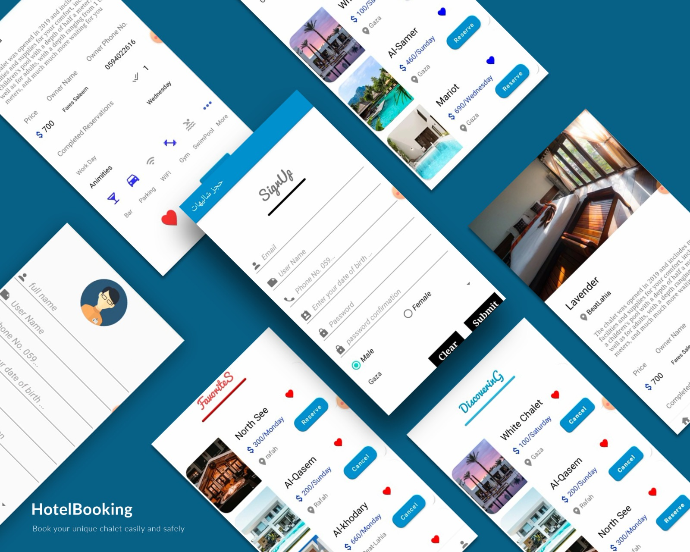

# 🏨 Hotel Booking App
[](LICENSE) <br>
This project was developed to address the need for an efficient chalet booking system in the Gaza Strip. It helps users easily find chalets and book them with just a few taps. The app leverages Android development best practices, including Firebase, RecyclerView, SQLite, and modern UI components.

---

## 📱 Overview
**Shalehat Booking App** is an Android application designed to help users find and book chalets in the Gaza Strip. This application offers detailed information about various chalets, including their images, prices, available facilities, and contact information. The user can register, book chalets, cancel reservations, and even express their admiration for their favorite chalets.
The app provides a platform for users to view and book chalets with a simple and intuitive interface. Users can view a list of available chalets, check their details, and make bookings. It also includes login functionality, allowing users to manage their accounts, reservations, and preferences.

---

## ✨ Features
- 🔐 **User Authentication**: Users can create an account using their email and log in to access all features.
- 🏠 **Chalet Details**: View chalet details including images, name, price, and owner contact info.
- 📝 **Booking**: Book chalets based on availability and cancel reservations if necessary.
- 💬 **Favorites**: Users can mark their favorite chalets for quick access.
- 📱 **User-Friendly Interface**: Clean and modern design with easy-to-navigate screens.
- 🛠️ **Real-time Updates**: Dynamic updates of chalet availability and booking status using Firebase.
- 🔄 **Swipe-to-Refresh**: Keep the app updated with the latest chalet information.
- 🧳 **SQLite Database**: Store user preferences and booking history locally for offline access.

---

## 🔧 Technologies Used
- 💻 **Android Studio** (Java)
- ☁️ **Firebase Realtime Database**
- 🗄️ **SQLite Database**
- 🖼️ **RecyclerView** for listing chalets
- 🧑‍💻 **Fragments** for modular UI
- 🧳 **Shared Preferences** for user settings
- 📞 **Firebase Authentication** for user login
- 🎨 **Material Design UI Components**
- 🔄 **Swipe Refresh** for refreshing content
- 🚚 **Intent** for navigation between activities

---

## 🛠️ Built With
- **Java** – for backend logic
- **XML** – for Android UI layouts
- **Android Studio** – development environment
- **Gradle** – build system

---

## 🚀 Getting Started
To get a local copy of the project running on your machine:
1. **Clone the repo**:
   ```bash
   git clone https://github.com/FaresSaleemGHub/Hotel-Booking-App.git
2. Open the project in Android Studio and click Open an existing project.
3. Build and run the app either on an emulator or a connected Android device.

---

## 📱 App Demo
Here’s a quick preview of the app in action:
### 🖼️ Image Preview


### 🎥 Video Demo
[▶️ Click to watch demo](https://www.youtube.com/watch?v=DU8zmgFDFFw)

---

## 👤 Author
Written with passion by – @FaresSaleemGHub

---

## 📜 License
This project is open-source and available under the MIT License.

